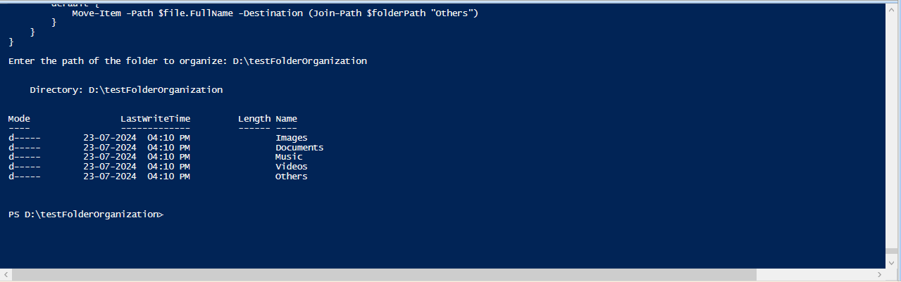
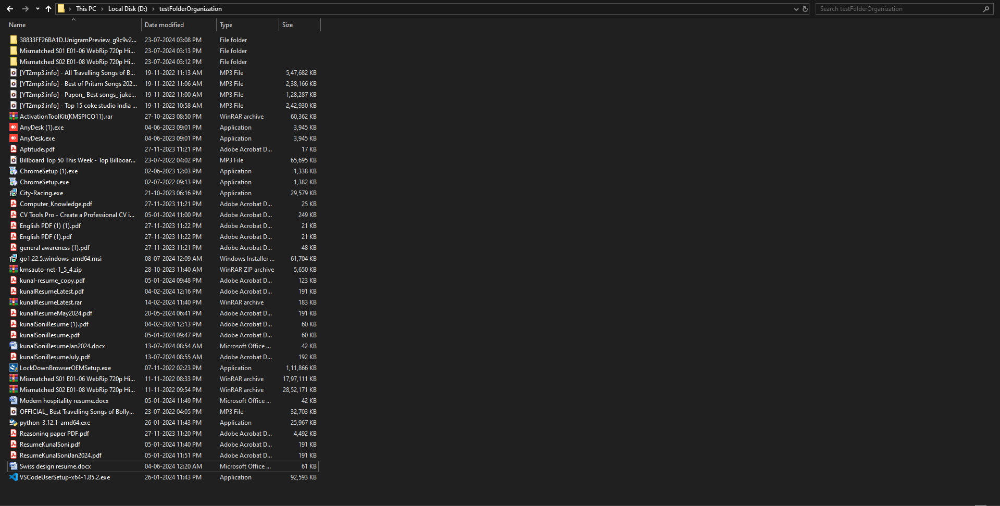
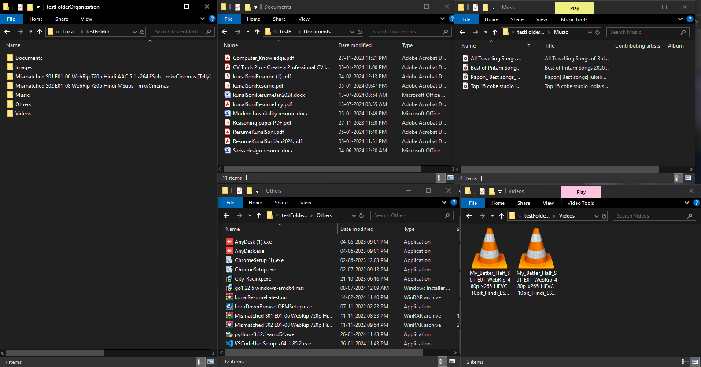

# Folder Organizer

## What it it?

It is a simple powershell script which takes a file path from the user as input, and then organizes it based on its extension.

## What do you need to run the script?

1. Windows Powershell ISE

2. File Path which can be fetched by following these steps:

    - Open file explorer
    - Navigate to the folder where you want to organize the files
    - Copy the file path mentioned at the top of the file explorer

## How to run it?

1. Copy the [script](https://github.com/kunalsoni76/folderOrganizer/blob/main/filesOrganizer.ps1)

2. Open Windows Powershell ISE and then click on new file.

3. Paste the script there and click on run.

4. Paste the file path where you want to run your script.

## How to know if the script worked?

You know the script worked if you got the below output:

Before running the script, your file may be onorganized like the image below:

But after running the script, your folder is organized like the image below:

